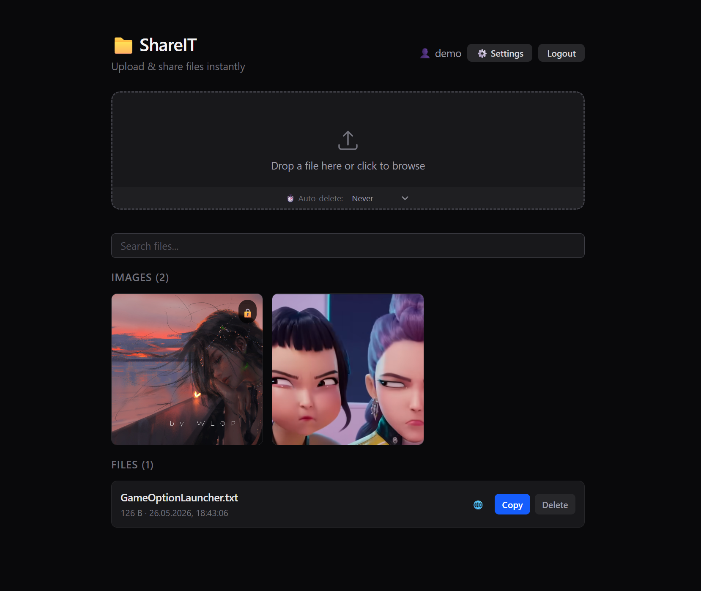

# ShareIT

Self-hosted file sharing app — Fastify + Next.js + Docker.

A clean, fast way to upload and share files. Built for ShareX integration with a Vercel-inspired dark UI, multi-file uploads, admin panel, and cloud storage support.



**Live demo:** https://goletz.dev

---

## Features

### Upload & Share
- Drag & drop or click to upload — supports multi-file uploads
- ShareX config generator (one-click setup)
- Public / private file visibility toggles
- Auto-expiring files (1–90 days)
- File type icons (📝🖼️📄📦) and image gallery with lightbox
- Markdown / text file preview with sanitized rendering
- Storage usage bar with quota tracking

### Admin Panel (Vercel-style dark UI)
- User management — create, edit, delete, search, change limits
- Database browser — browse tables, view rows, delete entries
- Storage configuration — local or Backblaze B2, editable in-app
- SSL / HTTPS status monitoring
- Analytics — upload trends, top users, file type distribution
- Backup system — run, download, view backup history with retry logic
- Collapsible sidebar (⌘+\), toast notifications, skeleton loading, metric cards
- Mobile-responsive with slide-out sidebar

### Tech
- JWT authentication with login lockout protection
- Rate limiting (global + per-endpoint)
- SQLite with WAL mode + automatic backups every 6h
- Local filesystem or Backblaze B2 storage
- Virus scanning support (ClamAV, optional)
- Caddy reverse proxy with automatic Let's Encrypt SSL
- CI/CD via GitHub Actions — tests → semantic-release → deploy

---

## Stack

| Layer | Tech |
|-------|------|
| Backend | Node 24, Fastify 5, TypeScript, SQLite |
| Frontend | Next.js 16, React 19, Tailwind CSS 4 |
| Infra | Docker, Caddy, GitHub Actions |
| Storage | Local filesystem or Backblaze B2 (S3-compatible) |

---

## Architecture

```
Caddy (SSL)
 ├── Fastify API (port 3000)
 │   ├── SQLite database
 │   ├── local uploads volume
 │   └── optional B2 cloud storage
 └── Next.js frontend (port 3001)
```

---

## Running locally

```bash
git clone https://github.com/lukasdevit/ShareIT.git
cd ShareIT

cp .env.example .env
# edit .env with your secrets

docker compose -f docker-compose.dev.yml up -d
```

| Service | URL |
|---------|-----|
| Frontend | http://localhost:3001 |
| API | http://localhost:3000 |

Dev mode mounts `src/` volumes for hot-reload on both services.

---

## Production deploy

```bash
git clone https://github.com/lukasdevit/ShareIT.git
cd ShareIT

cp .env.example .env
# edit .env with real values

docker compose up -d
```

Spins up API, frontend, and Caddy. Caddy auto-provisions SSL — just point a domain.

**Before going public:**
- Change default admin password
- Configure storage backend (local or B2)
- Review rate limits in `.env`
- Set `BACKUP_SCHEDULE_HOURS` (default: every 6h)

### CI/CD

Push to `main` triggers:
1. Tests (57 across 4 suites)
2. semantic-release (changelog + version bump)
3. SSH deploy — `git pull` + `docker compose up -d --build`

---

## Planned

- ~~multi-file uploads~~ ✅
- ~~better mobile UX~~ ✅
- ~~admin panel redesign~~ ✅
- ~~database backups~~ ✅
- ~~expanded MIME type support~~ ✅
- file versioning / replacement
- public sharing links with optional passwords
- upload chunking for very large files

---

## License

MIT
